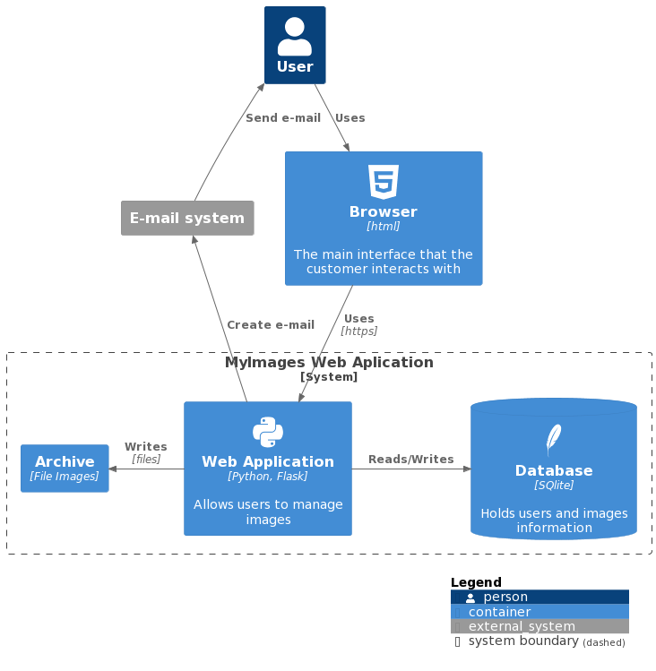

# MY_BF_Image

My Basic Flask

Exemplo de Protótipo de Aplicação Web (Prova de Conceito) de CRUD de usuários e imagens

# A. Ambiente de Desenvolvimento

Existe uma estrutura base que vamos seguir para a construção de nossas aplicações em [Flask](https://flask.palletsprojects.com/en/2.3.x/): 

## 1. Virtual Environment

Vamos usar o esquema de [virtual environment](https://docs.python.org/3/library/venv.html)

```bash
python3 -m venv venv
```

Mais detalhes em [python venv](https://packaging.python.org/en/latest/guides/installing-using-pip-and-virtual-environments/#creating-a-virtual-environment)

### 1.1 Para ativar o venv (Linux e MacOS)

```bash
source venv/bin/activate
```

### 1.2 Para desativar o venv 

```bash
deactivate
```

## 2. Uma vez criado e ativado o venv precisamos instalar os módulos, pacotes e bibliotecas usadas pela aplicação

```bash
pip3 install -r requirements.txt
```

## 3. Para executar a aplicação principal

```bash
flask --app principal run --host=0.0.0.0 --port=5000
```

Abra o browser: http://localhost:5000


# B. Descrição da estrutura da aplicação 

Segue uma breve descrição dos diretórios e arquivos:

**app/**: O diretório principal da aplicação.

**app/tests/**: diretório contendo a implementação dos casos de testes da aplicação

**app/controllers/**: diretório que contém os controladores ou [blueprints](https://flask.palletsprojects.com/en/2.3.x/blueprints/) da aplicação. Os arquivos authentication.py, usuarios.py e dashboard.py definem as rotas e a lógica associada a cada uma delas.

**app/static/**: diretório que contem os arquivos e recursos estáticos da aplicação

**app/templates/**: O diretório que contém os templates HTML usados para renderizar as páginas da sua aplicação. Os templates estão organizados em subdiretórios, como auth/,  usuarios/ e dashboard/ correspondendo aos controladores aos quais eles pertencem.

**app/models.py**: O arquivo que contém as definições das classes de modelo da sua aplicação. A classe Usuario está definida neste arquivo.

**app/utils**: Corresponde ao pacote de utilidades da aplicação.

**app/dao.py**: Padrão Data Access Object (DAO) pattern, que é bom para separar interações de banco de dados de outras lógicas.

**app/extensions.py**: Inicialização do banco de dados e configurações do Login Manager.

**app/forms.py**: Classe para facilitar a manipulação de forms html e validação de dados.

**app/models.py**: Representa as classes de modelo da aplicação.

**app/instance/users.db**: O arquivo de banco de dados [SQLite](https://www.sqlite.org/docs.html) onde os dados dos usuários e as informações de imagens são armazenadas.

**principal.py**: O ponto de entrada da aplicação Flask, onde você cria a instância do aplicativo e registra os blueprints.

**exec.sh**: Script bash para executar a aplicação

**requirements.txt**: Um arquivo que lista as dependências do projeto.

**README.md**: Um arquivo de documentação contendo informações sobre o projeto.

# C. Casos de Uso da Aplicação

<!-- [](docs/usecases.png) -->

<!-- [Detalhamento](https://github.com/my-prototypes/tflk/blob/main/docs/Casos_de_Uso_MyImages.pdf) -->

# D. Visão Geral da Arquitetura

Esta seção apresenta uma visão geral da arquitetura de software da aplicação "MyImages". Descreve os principais componentes, camadas e fluxo de dados da aplicação, fornecendo uma compreensão geral da estrutura e organização do sistema.

## Abordagem baseada em camadas

A arquitetura da aplicação segue uma abordagem de camadas, separando as responsabilidades e promovendo a modularidade. Ela consiste nos seguintes componentes principais:

### Camada de Apresentação (Presentation Layer):

Responsável por lidar com a interface do usuário e a interação com o cliente.
Composta pelos templates HTML localizados na pasta app/templates, que definem a estrutura e o layout das páginas. Os arquivos de template são renderizados pelo Flask para exibir as informações dinâmicas do sistema.

### Camada de Controle (Controller Layer):

Gerencia as requisições HTTP, processa a lógica de negócios e direciona as ações apropriadas. Implementada nos módulos authentication.py, usuarios.py e dashboard.py localizados na pasta app/controllers. Os controladores recebem as requisições do cliente, extraem os parâmetros necessários e invocam os serviços correspondentes.

### Camada de Dados (Data Layer):

Responsável pela manipulações de dados entre a aplicação e o banco de dados. Implementada nos módulos dao.py e models.py localizado na pasta app. 

## Diagrama de Componentes

Arquitetura ([C4](https://c4model.com/)) de Alto Nível 



Componentes da Aplicação (Web Application)

```
@startuml
package "App" <<Cloud>> {
  [Controllers]
  [Templates]
  [DAO]
  [Models]
}
[Controllers] ..> [Templates]
[Controllers] ..> [Models]
[Controllers] ..> [DAO]
[DAO] ..> [Models]
@enduml
```


Neste diagrama, temos os seguintes componentes mais importantes:

**Controllers**: Estes componentes são responsáveis por receber as requisições do cliente, manipular os dados necessários e chamar os serviços apropriados. Eles interagem com os componentes Templates, Models e Repositories. No contexto do padrão [MVC](https://en.wikipedia.org/wiki/Model%E2%80%93view%E2%80%93controller), os Controllers atuam como os controladores da aplicação, lidando com a lógica de controle e coordenação das interações entre as outras camadas.

**Templates**: Estes componentes contém os arquivos de templates ou views que são usados para renderizar a interface do usuário. Os templates são populados com os dados fornecidos pelos Controllers e exibidos ao usuário final.

**Models**: Estes componentes contém as classes que representam os objetos de domínio ou entidades da aplicação. Os Models também podem encapsular a lógica de negócio e o estado dos dados. Eles são utilizados pelos Controllers para obter os dados das entidades base.

**DAO**: Este componente é responsável pelo acesso e manipulação dos dados fornecendo uma interface para buscar, criar, atualizar e excluir registros no banco de dados. Eles são utilizados pelos Controllers para realizar operações de persistência.

Essa arquitetura pode ser divida em camadas, seguindo os conceitos do MVC, o que ajuda a separar as responsabilidades da aplicação, tornando o código mais modular, reutilizável e facilitando a manutenção. Os Controllers lidam com a lógica de controle, os Templates cuidam da apresentação e os Models encapsulam as entidades base da aplicação e interagem com o DAO para acessar os dados persistentes.

## Fluxo de dados de referência

O fluxo de dados na aplicação segue o seguinte padrão:

O cliente (navegador) faz uma requisição HTTP para uma determinada URL, como /login, /cadastrar, /listar, etc.

O Flask, como framework, recebe a requisição e identifica o controlador correspondente com base na rota definida nas rotas registradas.

O controlador processa a requisição, extrai os dados necessários dos parâmetros da requisição ou do formulário enviado pelo cliente.

O controlador invoca o serviço apropriado, passando os dados relevantes.

O serviço realiza as operações necessárias, como cadastro de usuário, autenticação ou consulta ao banco de dados.

O serviço retorna os resultados para o controlador.

O controlador renderiza o template HTML apropriado, passando os dados resultantes para serem exibidos ao cliente.

O Flask envia a resposta HTTP contendo o HTML renderizado de volta para o cliente, que exibe a página ao usuário.

# E. Tecnologias e configurações do projeto

## Tecnologias

Aqui estão as principais tecnologias e frameworks utilizados na aplicação:

**Flask**: Flask é um framework web em Python utilizado para desenvolvimento de aplicações web. Ele fornece recursos para gerenciamento de rotas, renderização de templates, manipulação de requisições e muito mais. É a base da aplicação e permite a criação de uma aplicação web de forma simples e eficiente.

**SQLite**: SQLite é um banco de dados relacional embutido utilizado para armazenar os dados dos usuários cadastrados na aplicação. É uma opção leve e prática para aplicações de pequeno a médio porte.

**HTML**: [HTML](https://en.wikipedia.org/wiki/HTML) (Hypertext Markup Language) é a linguagem de marcação utilizada para estruturar e organizar o conteúdo das páginas web. É a base para a criação dos templates HTML da aplicação.

**CSS**: [CSS](https://en.wikipedia.org/wiki/CSS) (Cascading Style Sheets) é uma linguagem utilizada para estilizar e formatar as páginas web. É utilizada para definir o layout, cores, fontes e outros aspectos visuais da aplicação.

**PlantUML**: [PlantUML](https://en.wikipedia.org/wiki/PlantUML) é uma ferramenta para criação de diagramas UML de forma textual. Foi utilizado para gerar os diagramas de componentes e camadas da aplicação.

**AdminLTE**: [AdminLTE](https://adminlte.io) é um framework de interface do usuário (UI) e um tema de administração de código aberto amplamente utilizado para criar painéis e painéis de administração modernos, responsivos e atraentes.

Essas são as principais tecnologias e frameworks utilizados na aplicação. Cada uma desempenha um papel importante na construção e funcionamento da aplicação web Flask, desde o framework Flask em si até as linguagens de marcação utilizadas para criar as páginas web.

